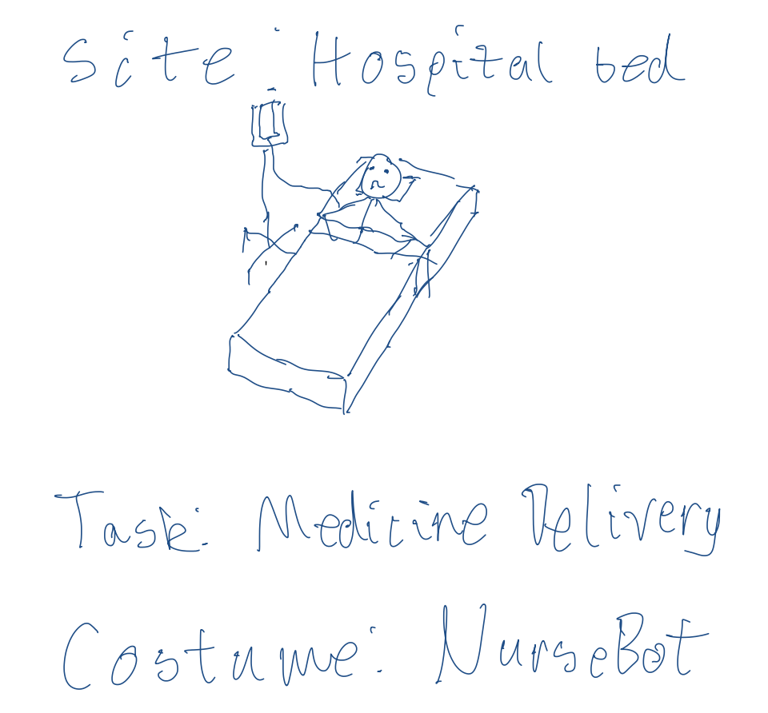
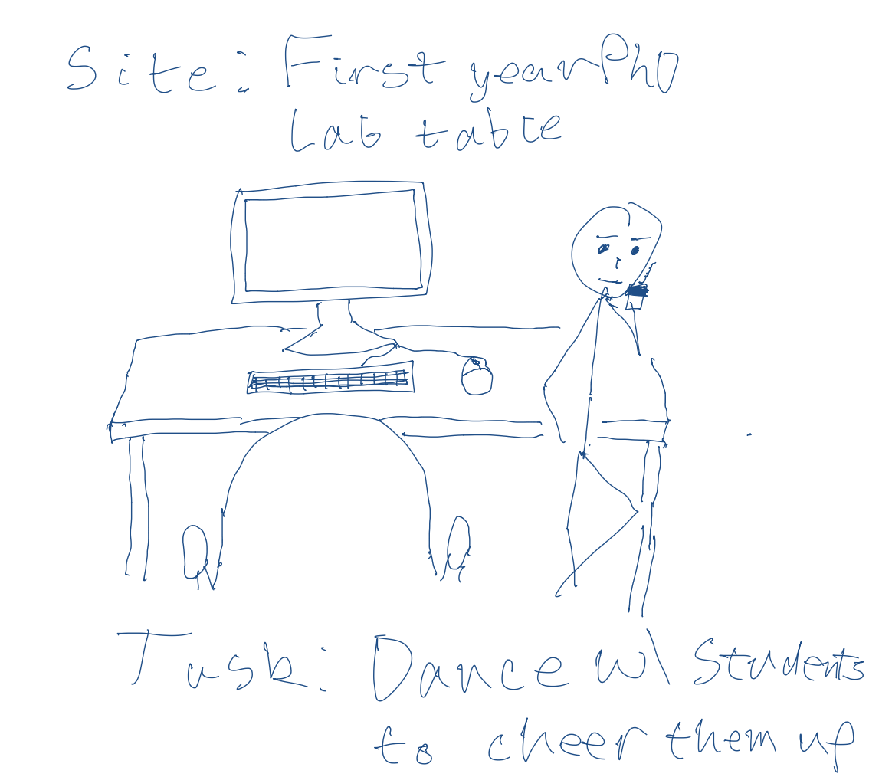
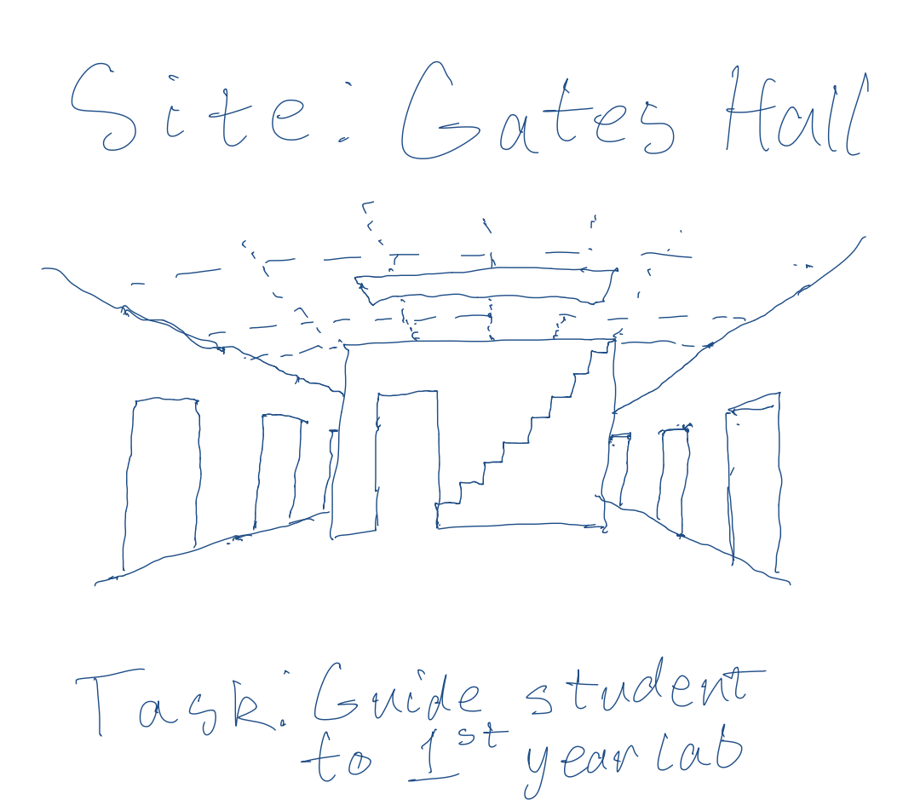
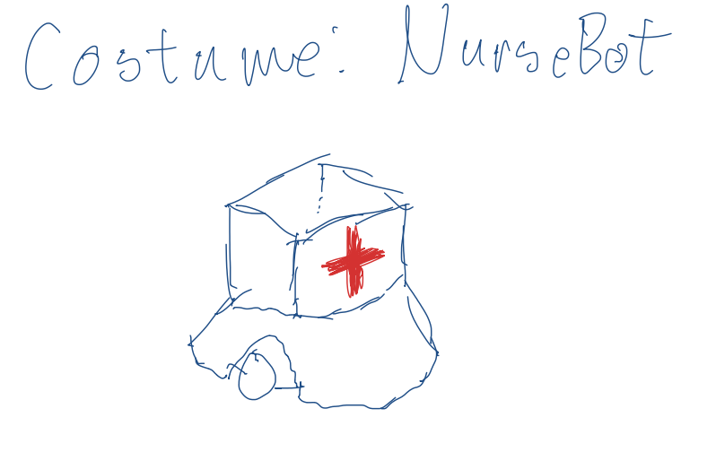
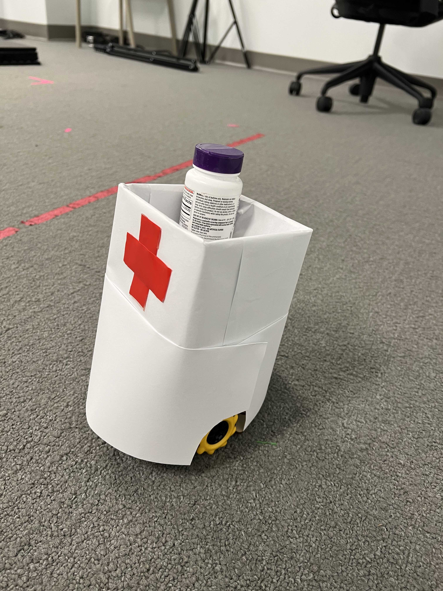
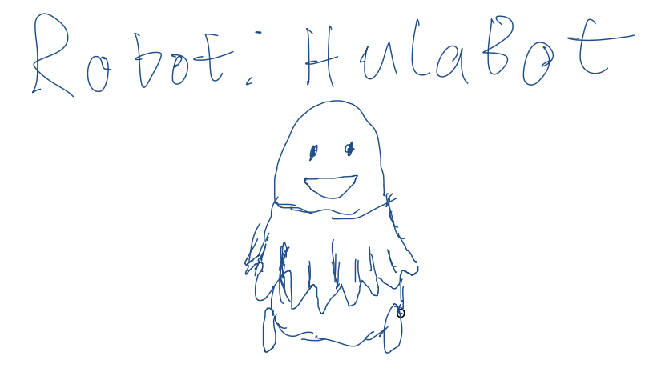
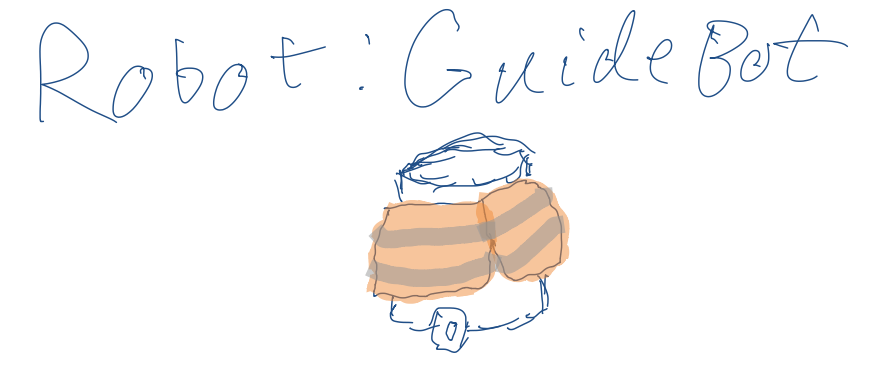
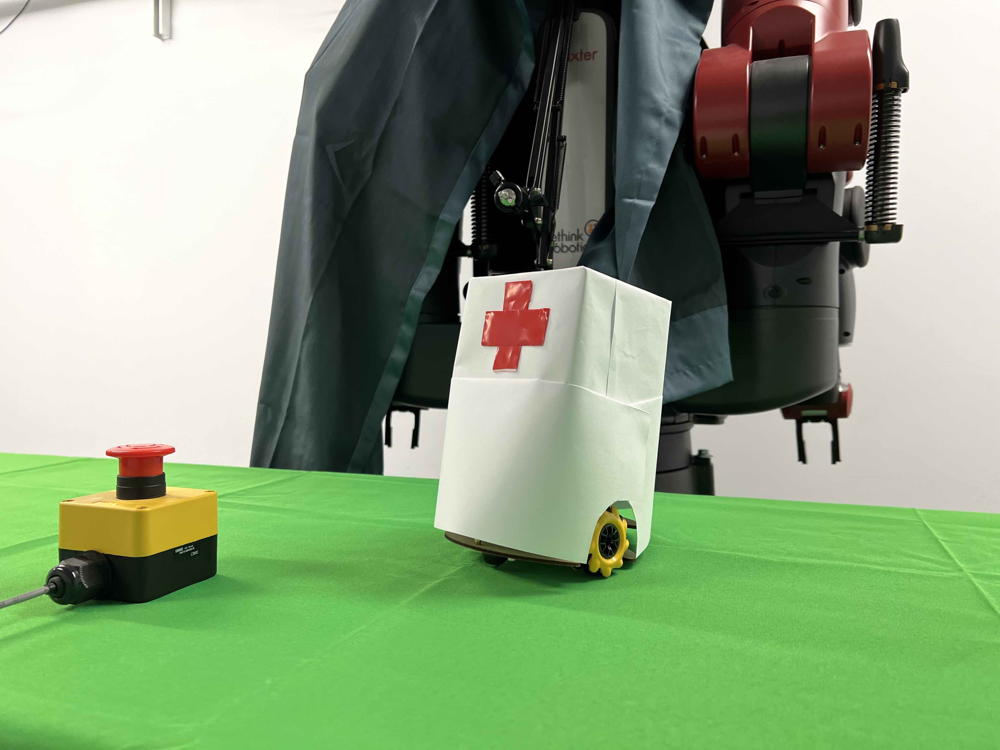

# Then Prototype the Robot
\*\***Nhan Tran (nt322) and Andrew Violette (amv78)**\*\*

## Lab Overview
For this assignment, you are going to:

A) [Provide feedback to your peers](#part-a-provide-feedback)

B) [Site the interaction](#part-b-site-the-interaction)

C) [Costume the robot](#part-c-costume-the-robot)

D) [Wizard the robot](#part-d-wizard-the-robot) 

E) [Video record the interaction](#part-e-record)

## Part A. Provide Feedback

- *Our feedback for team of [yh374 and ck766](https://github.com/DanielZh99/Mobile_HRI_Lab_Hub/tree/main/Lab1) is that while the videos demonstrate viable interactions with the robot, they could better leverage the robot's mobility and effectively convey its intended application. However, after reviewing the storyboards, we gained a better understanding of the interaction's objectives, such as using waving gestures to signal traffic and clapping to activate lights in a mine. We believe the team is making progress in utilizing the robot's capabilities, but it is unclear in what scenarios these interactions will be beneficial.*

## Part B. Site the interaction

Think about where the interaction you are prototyping is going to occur-- on a desk? on a floor? indoors? outdoors?

What other people and objects are in that space?

What activities are going on in that space? What activity is the robot going to be involved in?

\*\***Sketch and/or take photos of the site(s) you are considering.**\*\*

\*\***Document the activities being considered.**\*\*

\*\***What issues or opportunties arise from the site and activities?**\*\*

#### 1. Site: Hospital 
- Activity: Healthcare workers go back and forth between patients' rooms to deliver medication and medical supplies. Patients need certain reminders to take their medications or meals.
- Opportunities:
    - Hospital robots can enable healthcare workers to perform tasks that ease stress and human labor, allowing them to focus on the patients' quality of care.
- Issues:
    - Navigating in chaotic environment and avoiding hitting humans, especially the vulnerable ones.
    - It can be difficult to establish trust.
- 

#### 2. Site: First-year PhD Lab Table
- Activity: Focused and reserved PhD students have limited time to socialize. 
- Opportunities:
    - Tabletop social robots could dance with students to cheer them up.
- Issues:
    - Some might find such social robot as a distraction.
    - Some might find it boring after awhile.
    - Robots' physical constrants might limit the number of interactive dance movements.
- 

#### 3. Site: Gates Hall at Cornell University
- Activity: Many students walk in the hallway; some may not know where certain rooms are.
- Opportunities:
    - A mobile robot can serve as an indoor navigator and gives out directions to lost/confused students. 
- Issues:
    - Navigating in indoor environment with many dynamic obstacles and humans can be difficult.
    - It's difficult to design robots that can climb stairs. Thus we're constrained to a lobby robot that can feasibly convese to humans but cannot maneuver around indoor.
- 
## Part C. Costume the robot

Only now should you start worrying about what the device should look like. Develop one costume so that CloneBot can fit into it's setting.

Think about the setting of the device: is the environment a place where the device could overheat? Is water a danger? 

Pick one of the custumes and make it with paper or cardboard or any other material!

\*\***Include sketches of what your robot might look like here.**\*\*
#### 1. Site: Hospital Robot with nurse outfit 

-  *Reflection: The nurse outfit worn by our robot may cause overheating since it covers the robot completely. The outfit imitates the protective gown worn by healthcare workers during the COVID-19 pandemic to prevent the transmission of bodily fluids. We allowed some space between the wheels for ventilation and movement and placed a box on top of the robot to indicate its purpose of delivering supplies. The red cross on the outfit is a nod to the traditional nurse cornette and signifies its application in healthcare.*

- * Here is our prototype after 20 minutes tinkering with cardboard and scratch paper.*

#### 2. Site: Dancing Robot with a hula skirt

   *Reflection: Our robot wears a hula skirt inspired by Hawaiian culture to showcase its dancing ability. It has enough room for wheel movement and ventilation, so overheating is not an issue. A minor concern is a piece of the skirt could get stuck in the wheels during the performance. Although there is minimal risk of water damage if the robot is placed on a table with cups or mugs, it is primarily designed for tabletop entertainment.*

#### 3. Site: Navigator Robot with reflective, protective costume.

*Reflection: To attract the attention of visitors in the hall and minimize collision, our guide bot sports a bright, reflective, orange vest resembling the ones worn by traffic workers who manage roadwork during both day and night. The vest is designed to cover the robot partially to reduce the risk of overheating and fabric entanglement. As the robot serves as a lobby greeter, the risk of water damage is minimal.*

## Part D. Wizard the Robot

\*\***Include your first attempts at recording the set-up video here.**\*\*

*Please click on the speaker/volume button for sound*

https://user-images.githubusercontent.com/10265967/218651235-e15ada78-9380-42f2-8d6e-356d9f19b1e0.mov

## Part E. Record

\*\***Take videos of your prototyped interaction.**\*\*

**YouTube: https://youtu.be/0fKNfsN-Z_4**

*Please click on the speaker/volume button for sound*

https://user-images.githubusercontent.com/10265967/218652109-8eb143a1-4468-4ce6-a702-ac31fa6d81a9.mov

\*\***Please indicate anyone you collaborated with on this Lab.**\*\*

- *Nhan Tran and Violette (equal contribution)*

\*\***Document everything here. (Particularly, we would like to see the storyboard and video, although photos of the prototype are also great.)**\*\*

- PDF file of designa and storyboard: https://github.com/megatran/Mobile_HRI_Lab_Hub/blob/main/Lab2/hri_lab2_robot_costumes.pdf

### Final reflection
- *In our lab, we practiced "storyboarding" to quickly sketch out our envisioned human-robot interactions. We drew inspiration from our daily lives and selected symbols associated with each robot's functionality, such as nurse headwear and a red cross for hospital delivery robots, and a bright, reflective vest for robot navigators. To maintain the robot's modesty and protect wires and electronics, we decided to fully clothe the robots. However, this would mean that some built-in sensors like cameras would be obstructed by the outfit. However, we opted for clothing that clearly displays the robot's function and role in the designated location. We could easily attach an external camera or webcam in a more suitable location with a better view of obstacles. We also considered the risk of overheating but resolved it by ensuring adequate ventilation and space around the wheels.*

### Again, deliverables for this lab are: 

- [x] Fill in the questions along the way! 
- [x] photos of costumed robots
- [x] Reflections on the process
- [x] Video sketch of 1 prototyped interactions with the costumed device
- [x] Submit the items above in the lab2 folder of your class [Github page], either as links or uploaded files. Each group member should post their own copy of the work to their own Lab Hub, even if some of the work is the same from each person in the group.
