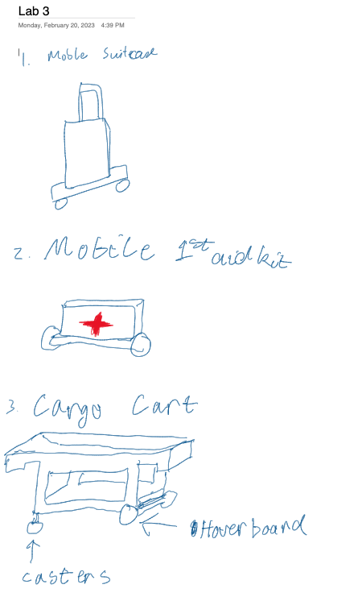

# Make the Robot Move
**Nhan Tran (nt322), Andrew Violette (amv78).**

### Deliverables for this lab are:
0. a video showing that you can control the hoverboard through python
1. three sketches of potential robots you can build with this platform. Be more realistic and think of these sketches as potential candidates for your final project. (Look around, what objects can you make mobile?)

### Part D. Sketch Again
Now that you are aware of the dimensions of the motors and the hoverboard base, create 3 sketches of potential robot forms your team wants to build.
Look around and see what you can automate. Keep the following points in mind.
- Feel free to use the original metal plate as a supporting structure, but you can attach the wheels to pretty much anything you want.
- As we discussed in class, be mindful of the placement of the wheels. Don't make a robot fall on people.
- Your robot will interact with people eventually.

Check Canvas discussion channel "Final Project Ideas" for ideas. We posted some of our proposals.

