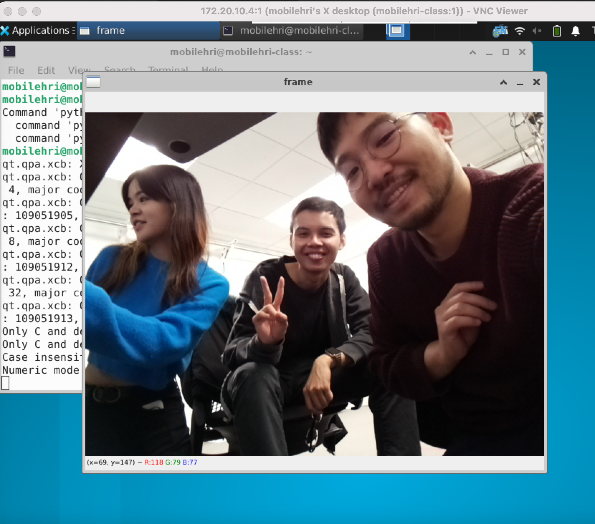

# Make the robot see
**nt322, ck766 **

Build off of Lab 3 from last week. This week's material can be done rather quickly.

### Deliverables for this lab are: 

0. A screenshot of the working VNC viewer with a working image view.

## Part D. Reflection

Reflect on the following questions:

1. For your favorite prototyped interaction that you have thought of so far, reflect upon how a camera connected to your Pi could be useful.

- _I think an RPi camera can be helpful in several ways. First, it can serve as a trigger to activate a command when a person is detected. For example, in the indoor navigator interaction, if a human approaches a robot, we can trigger it to utter a greeting. Second, in the hospital robot scenario, the camera can also do object detection, tracking where the human puts the pill bottle or whether they have picked it up._

2. What issues do you foresee with this setup? 

- _Processing delay can affect the real-time interaction._
- _Limited computing resource can affect other components. If a human detection model is running, other components on the robot might run slower._
- _Limited resolution and field of view can also degrade detection performance._

3. How is the temperature? How is the speed? How is the connection?

- _The temperature is little high. Speed is slow. Connection is unstable (slow frame rate)._

4. How is the view? Would it capture what you might need to see for your prototyped interaction (in question 1)?

- _The view is limited (less than 400x400 resolution). The human has to come really close to the camera for the detection model to work properly. It might be able to work in our use cases, but we might tinker with a different webcam._

https://user-images.githubusercontent.com/10265967/220987273-3b94b2bc-d56b-4661-831c-d4898fb3a039.MOV

